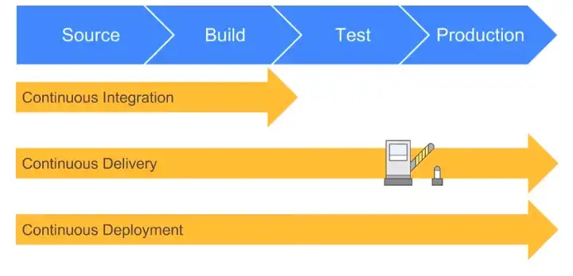
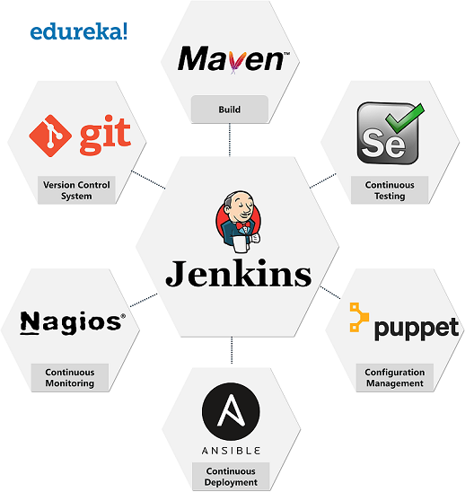
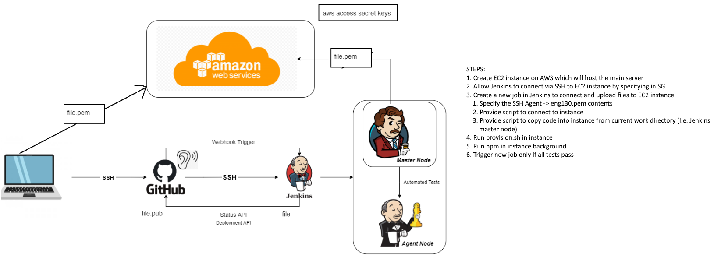

# CICD Pipeline and Jenkins

## Continuous Integration
Developers merge/commit code to master branch multiple times a day, fully automated build and test process which gives feedback within few minutes, by doing so, you avoid the integration hell that usually happens when people wait for release day to merge their changes into the release branch.
 - Developers merge/commit code to main branch multiple times a day
 - Fully automated build process - gives feedback in minutes
 - Fully automated test process - gives feedback in minutes
 - Avoids waiting for everyone to push to main at end of day as it is automatic
## Continuous Delivery
Continuous Delivery is an extension of continuous integration to make sure that you can release new changes to your customers quickly in a sustainable way. This means that on top of having automated your testing, you also have automated your release process and you can deploy your application at any point of time by clicking on a button.
 - Extension of continuous integration
 - On top of fully automated build and test process, release process is automated
 - Deployment is manual but one button click away
## Continuous Deployment
Continuous Deployment goes one step further than continuous delivery, with this practice, every change that passes all stages of your production pipeline is released to your customers, there is no human intervention, and only a failed test will prevent a new change to be deployed to production.
 - Extension of contunuous delivery
 - Every change which passes tests within production pipeline is released to customers
 - No human interaction unless a test has failed
 - Fully autonomous release

## CICD rundown

All about automating:
 - testing
 - deployment to stagin and production environment

## CICD tools

## What is a webhook
Webhook is a method of altering the behaviour of a webpage or web application with custom callbacks. These callbacks can be integrated and maintained by third party users or developers who may not necessarily be affiliated with the originating website or application.
## Jenkins
### What is Jenkins?
Jenkins is a self-contained, open source automation server which can be used to automate all sorts of tasks related to building, testing, and delivering or deploying software.
 - Great range of plugins available
 - Supports building, deploying, and automating for software development projects
 - Easy installation
 - Simple and user-friendly interface
 - Extensible with huge community-contributed plugin resource
 - Easy environment configuration in user interface
 - Supports distributed builds with master-slave architecture

## Steps to create CI
 1. Create a new CICD pipeline
 2. Generate new SSH keypair (ensure to generate it in .ssh folder on localhost)
 3. Copy `eng130_jenkins_angel.pub` to gihub repo
 4. Copy the private key in Jenkins
 5. Create job to test the CI
    1. Create webhook
 6. Create job for merge
 7. Create job for deployment

### Jobs Config

#### Testing dev branch job
1. General:
   1. Discard old builds (e.g. 3)
   2. GitHub project
      1. Paste in the https of github 
2. Restrict where this project can be run
   1. `sparta-ubuntu-node` for example
3. Source code Management
   1. Git
      1. SSH link to repo
      2. Add new git key to credentials for Jenkins
4. Build triggers
   1. GitHub hook trigger for GITScm polling
5. Build Environment
   1. Provide Node & npm bin/ folder to PATH
   2. Should autoselect
6. Build
   1. Execute shell
      1. `cd app`
      2. `npm install`
      3. `npm test`
7. Post-build Acitons
   1. select next job to execute and trigger accordingly

#### Merge in main
1. General:
   1. Discard old builds (e.g. 3)
   2. GitHub project
      1. Paste in the https of github 
2. Restrict where this project can be run
   1. `sparta-ubuntu-node` for example
3. Source code Management
   1. Git
      1. SSH link to repo
      2. Add git key to credentials for Jenkins
      3. Specify branch dev
4. Build
   1. Execute shell
      1. `git checkout main`
      2. `git status`
      3. `git merge origin/dev`
5. Post-build Acitons
   1. select next job to execute and trigger accordingly
   2. Configure Git Publisher to push if build is successful
      1. Branch to push: main
      2. Target remote name: origin

#### Upload files to EC2 instance
1. General:
   1. Discard old builds (e.g. 3)
   2. GitHub project
      1. Paste in the https of github 
2. Restrict where this project can be run
   1. `sparta-ubuntu-node` for example
3. Source code Management
   1. Git
      1. SSH link to repo
      2. Add new git key to credentials for Jenkins
4. Build triggers
   1. GitHub hook trigger for GITScm polling
5. Build Environment
   1. SSH Agent
      1. Provide .pem file key to connect to aws
6. Build
   1. Execute shell
      1. `rsync -avz -e "ssh -o StrictHostKeyChecking=no" app ubuntu@3.249.40.46:/home/ubuntu/`
      2. `rsync -avz -e "ssh -o StrictHostKeyChecking=no" environment ubuntu@3.249.40.46:/home/ubuntu/`
      3. `ssh -A -o "StrictHostKeyChecking=no" ubuntu@3.249.40.46 << EOF`
      4. `cd app`
      5. `sudo killall -9 node`
      6. `npm install`
      7. `nohup node app.js > /dev/null 2>&1 &`
      8. `EOF`
7. Post-build Acitons
   1. select next job to execute and trigger accordingly

#### Connecting to db
1. General:
   1. Discard old builds (e.g. 3)
   2. GitHub project
      1. Paste in the https of github 
2. Restrict where this project can be run
   1. `sparta-ubuntu-node` for example
3. Build Environment
   1. SSH Agent
      1. Provide pem file key
4. Build
   1. Execute shell
      1. `ssh -A -o "StrictHostKeyChecking=no" ubuntu@3.249.40.46 << EOF`
      2. `sudo killall -9 node`
      3. `export DB_HOST=mongodb://34.242.68.152:27017/posts`
      4. `echo 'Added Env'`
      5. `cd app`
      6. `npm install`
      7. `node seeds/seed.js`
      8. `nohup node app.js > /dev/null 2>&1 &`
      9. `EOF`
5. Post-build Acitons
   1. select next job to execute and trigger accordingly

## Steps to create CD

Testing fifth